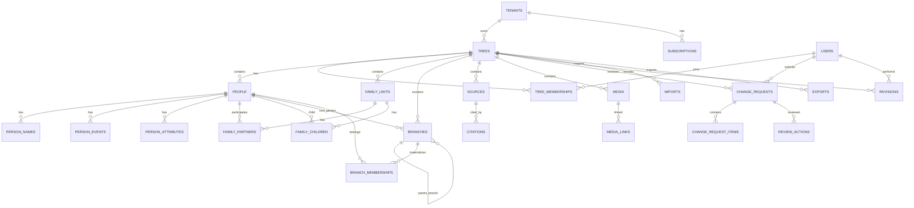
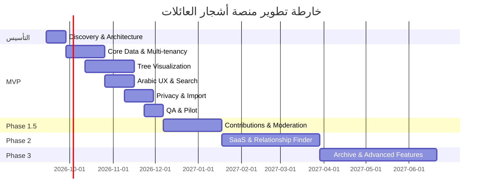

# الخطة الشاملة لمنصة أشجار العائلات والعشائر الرقمية

## الملخص التنفيذي

المشروع المقترح ليس «موقعًا لشجرة عشيرة الزعبي» فقط، بل **منصة عربية متعددة المستأجرين لإدارة وعرض وتوثيق أشجار العائلات والعشائر**، تكون أول شجرة منشورة عليها هي **عشيرة الزعبي – السلط**. التصميم الصحيح منذ البداية يسمح لاحقًا لأي عائلة أو عشيرة بإنشاء شجرتها الخاصة، دعوة أفرادها ومشرفيها، إدارة الخصوصية، استقبال التصحيحات، توثيق المصادر، ثم الاشتراك في خطط مدفوعة دون إعادة بناء النظام.

القرار المعماري الأهم هو أن تكون **شجرة الزعبي شجرة واحدة موحدة في قاعدة البيانات**. «العودتلات»، «القواسمة»، «الرحايمة»، «الخليفات»، «الجمعات» وغيرها لا تُنشأ كأشجار منفصلة؛ بل تُعرّف كـ`Branches` داخل الشجرة نفسها. عند اختيار «القواسمة» مثلًا يعرض النظام ذلك الفرع وحده بصريًا، ويمكن إعطاؤه رابطًا مستقلًا، لكن الأشخاص والعلاقات والمصادر تظل مرتبطة بالشجرة الجامعة نفسها. هذا يمنع ازدواجية الأشخاص، ويجعل البحث وحساب صلة القرابة والتحديثات أكثر اتساقًا.

المخططان اللذان زودتني بهما للقواسمة والعودتلات يؤكدان عمليًا طبيعة المشكلة: سلاسل متعددة الأجيال، نقاط تفرع عديدة، وحاجة حقيقية إلى فتح فرع محدد دون خسارة ارتباطه بالشجرة الجامعة. وهما مفيدان كنماذج لبنية البيانات والـUX، لكنهما لا يكفيان بمفردهما كمصدر تاريخي للتحقق من الأنساب، لذلك ستفصل المنصة بين **«وجود معلومة» و«درجة توثيقها»**. fileciteturn0file0 fileciteturn0file1

أوصي تقنيًا بـ **Laravel 13 API + Next.js/React/TypeScript + PostgreSQL 18 + Redis + S3-compatible object storage**. Laravel 13 هو الإصدار الحالي في 2026، ويتطلب PHP 8.3 على الأقل وتستمر تحديثاته الأمنية حتى مارس 2028؛ كما أن Next.js App Router الحالي مناسب لبنية واجهة React حديثة ولدعم تعدد اللغات والمسارات المحلية. هذا الاختيار يتوافق أيضًا مباشرة مع خبرتك الحالية في Laravel وReact، ما يخفض تكلفة التعلم والتنفيذ. citeturn16search0turn16search1turn16search2

بالنسبة لرسم الشجرة، أوصي بإجراء Prototype قصير بين **BALKAN FamilyTreeJS2** و**Renderer مخصص باستخدام D3** قبل الالتزام النهائي. BALKAN يختصر وقتًا كبيرًا في ميزات الأنساب والـfocus والـlazy loading، لكنه تجاري؛ خطة FamilyTreeJS2 Premium التي تسمح باستخدام SaaS معروضة حاليًا بسعر 996 دولارًا سنويًا، بينما النسخة الكلاسيكية FamilyTreeJS تعرض Premium SaaS بسعر 1,899 دولار بترخيص دائم. أما `react-d3-tree` فترخيصه MIT لكنه أكثر عمومية وأقل تخصصًا في الأنساب. citeturn14search2turn14search6turn15search2

**الخطة التي أوصي باعتمادها:**

| المستوى | النتيجة |
|---|---|
| MVP | شجرة موحدة ممتازة للزعبي، فروع، Focus، بحث عربي، ملفات أشخاص، خصوصية، إدارة، CSV |
| المرحلة 1.5 | مساهمات المجتمع، مراجعة واعتماد، مصادر، وسائط، GEDCOM، إشعارات |
| المرحلة 2 | SaaS كامل، أشجار متعددة، اشتراكات، Relationship Finder، صلاحيات متقدمة |
| المرحلة 3 | أرشيف عائلي، خرائط، Timeline، إحصائيات، كتب PDF، ميزات ذكية |
| أفضل مدة MVP لفريق 3–5 | نحو 8–10 أسابيع |
| MVP لمطور واحد | نحو 14–18 أسبوعًا |
| الميزانية التقديرية لـMVP بفريق محترف | تقريبًا 35–70 ألف دولار |
| البنية الشهرية الأولية | نحو 50–150 دولارًا، قبل نمو الاستخدام |
| أهم مخاطرة تقنية | رسم شجرة كبيرة مع الحفاظ على السرعة وسهولة الفهم |
| أهم مخاطرة إدارية | صحة بيانات الأنساب والخلافات حولها |
| أهم مخاطرة قانونية | بيانات الأشخاص الأحياء، خصوصًا الهاتف والسكن والصور |

منصات مثل **Gramps Web** و**webtrees** تثبت أن المنتج الجاد في هذا المجال يحتاج أكثر من رسم شجرة: مصادر واستشهادات، وسائط، بحث، صلاحيات، خصوصية، Revision History، استيراد وتصدير، ورسوم علاقات متعددة. Gramps Web يوفر بالفعل شجرًا تفاعلية، رسوم علاقات، تاريخ مراجعات مع Undo، مصادر واستشهادات، استيرادًا تجريبيًا Dry Run، مهام خلفية، وواجهة تعمل على الأجهزة المختلفة؛ وwebtrees يوفر خصوصية على مستوى الموقع والشجرة والمستخدم والسجل والمعلومة نفسها. citeturn14search0turn14search3turn15search1

**الخلاصة التنفيذية:** لا أبني «نسخة مصغرة من MyHeritage». أبني **Arabic Family Knowledge Platform** يكون محور المنتج فيها:

> الشخص ← علاقاته ← فرعه ← الشجرة الجامعة ← المصادر ← التاريخ ← المجتمع.

## مرجعيات السوق ونطاق المنتج

أفضل ما يمكن أخذه من المنتجات الحالية ليس شكلها البصري حرفيًا، بل القرارات التي نجحت فيها.

| المنتج | ما نتعلمه منه | ما يجب أن نفعله أفضل |
|---|---|---|
| Gramps Web | شجرة تفاعلية، مصادر، citations، وسائط، revisions، undo، تقارير، import/export، مهام خلفية | واجهة عربية أبسط وأوضح للعائلة غير التقنية. citeturn14search0turn14search3 |
| webtrees | Privacy دقيقة جدًا، تعاون، branches، أنواع متعددة من الرسوم، PDF reports | واجهة أكثر حداثة وتجربة Mobile-first. citeturn15search1turn15search14 |
| Family Echo | البساطة الشديدة في إضافة الأب/الأم/الأبناء والشريك، ودعم GEDCOM | Governance ومصادر ومراجعة أقوى. citeturn15search3turn15search6 |
| Genea.app | Privacy-by-design، GEDCOM، عدم حبس البيانات، عمل Desktop/Mobile | إضافة SaaS وتعاون Moderated بدل local-first فقط. citeturn15search0 |
| GEDCOM | معيار التبادل بين تطبيقات الأنساب | نحتفظ بنموذج داخلي أغنى ولا نجعل قيود GEDCOM تقيد المنتج. citeturn14search1turn14search4 |

**تموضع المنتج المقترح:**

> **منصة عربية لتوثيق واستكشاف الأنساب والأرشيف العائلي بصورة تعاونية وموثقة وآمنة.**

وبذلك تصبح الشجرة إحدى واجهات المنصة، وليست المنصة كلها.

**مثال الزعبي داخل النموذج العام:**

```text
المنصة
│
├── عشيرة الزعبي – السلط
│   │
│   ├── الشجرة الجامعة
│   │
│   ├── العودتلات
│   │   └── فروع فرعية...
│   │
│   ├── القواسمة
│   │   └── فروع فرعية...
│   │
│   ├── الرحايمة
│   ├── الخليفات
│   ├── الجمعات
│   └── فروع أخرى حسب البيانات المعتمدة
│
├── عائلة / عشيرة أخرى
│
└── عائلة / عشيرة أخرى
```

الأسماء السابقة تعامل في مرحلة التصميم كأمثلة من متطلباتك؛ الاعتماد النهائي للأسماء والتهجئة والجذور ونقاط الربط يجب أن يتم من البيانات والمصادر التي يعتمدها مدير شجرة الزعبي.

أما سلسلة **آدم ← … ← الجد الجامع ← الفروع** فيجب أن يسمح النظام بتمثيلها، لكنني أوصي بعدم تقديم أي علاقة تاريخية قديمة للمستخدم على أنها «حقيقة مؤكدة» لمجرد إدخالها. الأفضل أن يحتوي كل Fact أو Relationship على مصدر ودرجة ثقة مثل: `موثق`، `مرجح`، `رواية عائلية`، `مختلف عليه`، `غير موثق`. GEDCOM نفسه يدعم المصادر وبعض مفاهيم حالة العلاقة، لكنه لا يغطي كل احتياجات تقييم الثقة البحثية؛ لذلك من الأفضل أن يكون نموذج المنصة أغنى. citeturn14search1

**أولوية مراحل المنتج:**

| المرحلة | الميزات ذات الأولوية |
|---|---|
| **MVP** | Authentication، بنية Multi-tenant، شجرة موحدة، الأشخاص والعائلات والعلاقات، الفروع، الشجرة الجامعة، Focus على فرع، Focus على شخص، Zoom/Pan، Collapse/Expand، البحث العربي، صفحة الشخص، الخصوصية الأساسية، المصادر الأساسية، Admin CRUD، CSV Import Dry Run، Revision Log، Desktop/Mobile |
| **Phase 1.5** | التسجيل العام، Contributors، اقتراح تعديل، اقتراح شخص، تعديل علاقة، Moderation Queue، Before/After Diff، طلب توضيح، Notifications، Media Gallery، citations متقدمة، GEDCOM Import/Export، conflict detection |
| **Phase 2** | إنشاء الأشجار ذاتيًا، دعوات الأعضاء، Relationship Finder، خطط واشتراكات، Billing، URLs مخصصة، صلاحيات متقدمة، GEDZIP، Advanced Search، async exports، Printable PDFs، إدارة مساحة التخزين |
| **Phase 3** | الخرائط، Timeline، إحصائيات، Digital Family Archive، Family Book PDF، صفحات تذكارية، PWA متقدمة، كشف التكرار، اقتراحات ذكية، بحث دلالي، مساعدة AI مع منع الاعتماد التلقائي للمعلومات |

هذه الأولوية تتماشى مع الدروس الواضحة من Gramps Web: الاستيراد التجريبي قبل الكتابة، المهام الخلفية، تاريخ التعديلات، عدم حبس البيانات، والعمل على الأجهزة المختلفة كلها خصائص مهمة في منصة ناضجة. citeturn14search0

وأهم **trade-off** يجب أن يُفهم من البداية هو أن عبارة «عرض الشجرة كاملة» لا ينبغي أن تعني إنشاء 20,000 أو 100,000 عنصر DOM في الشاشة في اللحظة نفسها. الشجرة تظل **موحدة كاملة منطقيًا في قاعدة البيانات**، لكن الواجهة تستخدم collapse/lazy loading/level-of-detail والتحميل حسب المنطقة المرئية. هذا الفرق هو ما يجعل المشروع قابلًا للتوسع.

## المتطلبات التفصيلية والحوكمة والصلاحيات

**المتطلبات الوظيفية بمستوى SRS:**

| ID | المتطلب | معيار قبول مختصر |
|---|---|---|
| FR-01 | دعم عدة مؤسسات/عائلات `Tenants` | لا يستطيع Tenant الوصول لبيانات Tenant آخر |
| FR-02 | دعم عدة Trees داخل المنصة | كل Tree لها إعداداتها وأعضاؤها وخصوصيتها |
| FR-03 | الشجرة الجامعة | جميع أفراد العائلة مرتبطون بGraph واحدة دون نسخ الفروع |
| FR-04 | Branches | تعريف قبيلة/عشيرة/فخذ/فرع بأي عدد من المستويات |
| FR-05 | Branch Focus | اختيار فرع يخفي/يعتم البقية بصريًا دون إنشاء Tree جديدة |
| FR-06 | Person Focus | اختيار شخص يبرزه ويعتم غير المرتبطين ويظهر أسرته قبل/بعد |
| FR-07 | العلاقات | أب، أم، أبناء، شركاء/أزواج، تبنٍ وأنواع parentage عند الحاجة |
| FR-08 | الملف الشخصي | اسم، صورة، حالة حياة، ميلاد/وفاة، مهنة، رتبة، سكن، هاتف، ملاحظات |
| FR-09 | Optional Attributes | عدم إجبار جميع الأشخاص على نفس مجموعة الحقول |
| FR-10 | التاريخ والعمر | تخزين تواريخ الميلاد/الوفاة وحساب العمر، لا تخزين العمر كحقيقة مستقلة |
| FR-11 | تواريخ غير مؤكدة | «حوالي»، «قبل»، «بعد»، «بين»، «سنة فقط»، «غير معروف» |
| FR-12 | Arabic Search | البحث بالاسم والأسماء البديلة والكنية والفروع مع تحمل التشكيل |
| FR-13 | Relationship Finder | حساب وعرض مسار العلاقة بين شخصين |
| FR-14 | Sources | ربط الحقائق والعلاقات بالمصادر |
| FR-15 | Citations | حفظ الصفحة/المرجع/الموضع والملاحظة ودرجة الثقة |
| FR-16 | Media | صور، وثائق، PDF، صوت، فيديو أو روابط حسب السياسة |
| FR-17 | Change Requests | المستخدم يرسل اقتراحًا ولا يغير Canonical Data مباشرة |
| FR-18 | Moderation | قبول، رفض، طلب توضيح، قبول جزئي |
| FR-19 | Revisions | الاحتفاظ بمن غيّر ماذا ومتى والقيمة قبل/بعد |
| FR-20 | Privacy | التحكم على مستوى Tree/Person/Fact/Attribute/Media |
| FR-21 | CSV | استيراد وتصدير Template خاص بالمنصة |
| FR-22 | GEDCOM | قراءة GEDCOM 5.5.1 و7، وتصدير GEDCOM 7 |
| FR-23 | Notifications | إشعارات للمساهمين والمشرفين عند تغير حالات الطلبات |
| FR-24 | Admin | إدارة الأشخاص والفروع والمستخدمين والمصادر والإعدادات |
| FR-25 | Subscription | بنية بيانات جاهزة للخطط والحدود والفواتير |
| FR-26 | Export | تصدير البيانات دون vendor lock-in |
| FR-27 | Audit | سجل مستقل للعمليات الأمنية والإدارية الحساسة |

Gramps Web يعتبر revisions معاملات مترابطة ويستطيع عرض الفرق والتراجع عن transaction، مع اكتشاف أن بيانات أحدث قد تجعل Undo غير آمن. هذه بالضبط الفلسفة التي أوصي بتطبيقها، لكن مع ربط الـtransaction أيضًا بـ`ChangeRequest`. citeturn14search3

**المتطلبات غير الوظيفية المقترحة:**

| المجال | Target |
|---|---|
| اللغة | العربية `ar-JO` هي اللغة الافتراضية، RTL أصلًا وليس ترجمة لاحقة |
| Responsive | 360px فما فوق، Desktop حتى الشاشات الواسعة |
| Accessibility | WCAG 2.2 AA |
| Search | p95 أقل من 500ms في الأحجام الأولية |
| API CRUD | p95 أقل من 300ms للطلبات البسيطة تحت الحمل الطبيعي |
| Graph Focus | أقل من ثانية للـcached branch المعتاد |
| UX Tree | استجابة pan/zoom سلسة وعدم تجميد الصفحة |
| Availability MVP | 99.5% |
| Availability SaaS | 99.9% مستهدف |
| Backup MVP | RPO ≤ 24 ساعة، RTO ≤ 4 ساعات |
| Phase 2 | RPO قرابة ساعة مع PITR |
| Security | OWASP ASVS 5.0 Level 2 كهدف تحقق |
| Observability | logs + errors + metrics + queue monitoring |
| Data Integrity | منع self-parent، العلاقات الدائرية غير المنطقية، التواريخ المستحيلة |
| Scalability | التصميم يستهدف 100k شخص/Tree دون تغيير جوهري للنموذج |
| Portability | Export كامل للبيانات والوسائط |

OWASP ASVS 5.0.0 هو الإصدار المستقر الحالي ويوفر مجموعة متطلبات قابلة للاختبار لأمن تطبيقات الويب، ولذلك يصلح كخط أساس أمني للمشروع. citeturn21search0

WCAG 2.2 يضيف متطلبات مهمة جدًا لهذه الواجهة تحديدًا، ومنها وجود بديل للعمليات التي تعتمد على السحب Dragging، وألا تكون عناصر النقر أصغر من 24×24 CSS px إلا وفق الاستثناءات. لذلك لا يكفي أن تكون الشجرة قابلة للسحب؛ يجب توفير أزرار «تكبير، تصغير، تحريك، تمركز، عرض الفرع» قابلة للاستخدام دون Drag. أوصي عمليًا بأهداف لمس 44–48px على الهاتف، وهو Target داخلي أكثر راحة من الحد الأدنى. citeturn18search0turn18search5

**نموذج الأدوار والصلاحيات:**

| العملية | Guest | Member | Contributor | Moderator | Tree Admin | Platform Admin |
|---|---:|---:|---:|---:|---:|---:|
| رؤية البيانات Public | ✓ | ✓ | ✓ | ✓ | ✓ | ✓ |
| رؤية بيانات أعضاء الشجرة المسموح بها | — | ✓ | ✓ | ✓ | ✓ | عند الحاجة فقط |
| رؤية بيانات حساسة | — | حسب السياسة | حسب السياسة | لأغراض المراجعة | ✓ | Break-glass |
| البحث والتنقل | ✓ | ✓ | ✓ | ✓ | ✓ | ✓ |
| إرسال اقتراح | — | اختياري | ✓ | ✓ | ✓ | ✓ |
| تعديل Canonical مباشرة | — | — | — | يفضل لا | ✓ | ✓ |
| مراجعة الاقتراحات | — | — | — | ✓ | ✓ | ✓ |
| إدارة المصادر | — | — | اقتراح | ✓ | ✓ | ✓ |
| إدارة الفروع | — | — | اقتراح | حسب التفويض | ✓ | ✓ |
| إدارة أعضاء Tree | — | — | — | — | ✓ | ✓ |
| إدارة Privacy | — | — | — | — | ✓ | ✓ |
| Billing | — | — | — | — | ✓ | ✓ |
| كل Trees | — | — | — | — | — | ✓ |

الصلاحيات يجب ألا تعتمد على Role فقط. أوصي بـ**RBAC + ABAC**: القرار يأخذ في الحسبان `role + tree_id + living status + fact privacy + relationship to person + ownership`. PostgreSQL يمكنه كذلك استخدام Row-Level Security كطبقة دفاع إضافية؛ عند تفعيل RLS وغياب policy مطابقة يكون السلوك الافتراضي منع الوصول، لكن لا ينبغي الاعتماد عليه وحده بدل سياسات التطبيق. citeturn18search3

**الخصوصية الافتراضية للأشخاص الأحياء:**

webtrees يحمي الأشخاص الأحياء افتراضيًا، وهو precedent قوي يجب اتباعه. citeturn15search14

أوصي بالقواعد التالية:

| المعلومة | Living Person Default |
|---|---|
| الاسم | Members أو Public حسب إعداد Tree |
| الصورة | Members |
| تاريخ الميلاد الكامل | Family/Private |
| سنة الميلاد فقط | Members عند السماح |
| الهاتف | Private/Related Members |
| السكن العام «السلط» | Members أو Public حسب السياسة |
| العنوان الدقيق | Private |
| المهنة | Members أو Public اختيارياً |
| الرتبة | Members أو Public اختيارياً |
| الوثائق الرسمية | Private |
| الملاحظات | Members |
| المصادر التي تكشف معلومات حساسة | ترث أعلى مستوى Privacy |

في الأردن توجد حاليًا منظومة قانون حماية البيانات الشخصية رقم 24 لسنة 2023، وتؤكد وزارة الاقتصاد الرقمي والريادة حقوق صاحب البيانات ومسؤوليات الجهة المتحكمة بالبيانات وإجراءات الامتثال، كما أن مجلس حماية البيانات الشخصية مسؤول عن سياسات وتصاريح متعلقة بالتخزين والمعالجة ونقل البيانات. لذلك قبل الإطلاق العام ينبغي إجراء مراجعة قانونية أردنية، خصوصًا للهاتف والسكن وصور ووثائق الأشخاص الأحياء ونقل البيانات إلى استضافة خارج الأردن. هذه ليست استشارة قانونية نهائية. citeturn20search0turn20search14turn20search9

**Workflow مقترح للتعديلات:**

```text
DRAFT
  │
  ▼
SUBMITTED
  │
  ▼
TRIAGED
  │
  ├──────────────► NEEDS_INFO
  │                    │
  │                    └──────► SUBMITTED
  ▼
IN_REVIEW
  │
  ├──────────────► REJECTED
  │
  ├──────────────► PARTIALLY_APPROVED
  │
  └──────────────► APPROVED
                         │
                         ▼
                      APPLYING
                         │
                         ▼
                       APPLIED
```

مثال: مستخدم يقترح تغيير سكن شخص من «السلط» إلى «عمّان»، يضيف صورة دفتر عائلة كمصدر، ويحفظ النظام `before_value`, `after_value`, `base_revision_id`. يصل إشعار للمشرف. يرى المشرف مقارنة واضحة قبل/بعد والمصدر. إذا تغير السجل الأصلي منذ تقديم الاقتراح، ينتقل الطلب إلى `CONFLICT` بدل تطبيق معلومة فوق تعديل أحدث. عند الاعتماد يتم تحديث الشخص وإنشاء Revision وAudit entry وربط المصدر في Transaction واحدة، ثم يُبلغ مقدم الطلب.

ولا أوصي بالسماح للمساهم بتعديل الشخص ثم محاولة «التراجع لاحقًا». الأفضل أن تظل الـCanonical Data سليمة حتى الموافقة.

## المعمارية ونموذج البيانات وواجهة API

**المكدس التقني الموصى به:**

| الطبقة | الاختيار | السبب |
|---|---|---|
| Frontend | Next.js + React + TypeScript | واجهة Graph تفاعلية ومكونات Server/Client واضحة |
| Localization | `next-intl` أو بديل ناضج | العربية أولًا ثم English |
| UI | Tailwind CSS + Design System مخصص | RTL وتحكم كامل بالواجهة |
| Backend | Laravel 13 REST API | Domain logic، policies، queues، jobs، notifications |
| Authentication | Laravel Sanctum | مناسب لتطبيق Web/API من نفس المنظومة |
| Authorization | Laravel Policies + RBAC/ABAC | Tree-level + fact-level rules |
| DB | PostgreSQL 18 | Recursive graph queries، RLS، بحث وفهارس قوية |
| Search MVP | PostgreSQL `pg_trgm` | لا حاجة لمحرك إضافي مبكرًا |
| Cache | Redis/Valkey | graph fragments، sessions، jobs |
| Queue | Laravel Queue + Redis | import/export/media/email |
| Files | Cloudflare R2 أو S3 | وسائط ووثائق خارج Web server |
| Admin | Filament أو Admin React خاص | تسريع CRUD الداخلي |
| Observability | Sentry + server metrics | أخطاء Front/Backend |
| CI/CD | GitHub Actions | tests/build/deploy |
| API docs | OpenAPI | handoff وتوليد clients |

Next.js يوثق رسميًا دعم تنظيم المسارات والترجمة حسب الـlocale، بينما App Router مبني على Server Components وSuspense وغيرها من قدرات React الحالية. citeturn16search1turn16search2

PostgreSQL اختيار قوي هنا لأن recursive CTEs مخصصة للتعامل مع البيانات الهرمية والشجرية، وتدعم البحث Depth/Breadth واكتشاف الدورات؛ كما أن `pg_trgm` يوفر similarity search وفهارس GiST/GIN للبحث النصي التقريبي. الإصدار الحالي الموثق هو PostgreSQL 18. citeturn17search0turn17search3turn17search4

**معمارية التشغيل:**

```text
                    ┌────────────────────────────┐
                    │ Next.js Web / PWA - RTL   │
                    │ Desktop + Mobile          │
                    └─────────────┬──────────────┘
                                  │ HTTPS
                                  ▼
                    ┌────────────────────────────┐
                    │ Laravel REST API           │
                    │ Auth / Policies / Domain   │
                    └───────┬─────────┬──────────┘
                            │         │
                 ┌──────────┘         └──────────────┐
                 ▼                                   ▼
       ┌───────────────────┐               ┌─────────────────┐
       │ PostgreSQL        │               │ Redis / Queue   │
       │ Trees / Graph     │               │ Cache / Jobs    │
       └───────────────────┘               └────────┬────────┘
                                                   │
                                                   ▼
                                           ┌───────────────┐
                                           │ Workers       │
                                           │ Import/Export │
                                           │ Media/PDF     │
                                           └───────┬───────┘
                                                   │
                                                   ▼
                                           ┌───────────────┐
                                           │ R2 / S3       │
                                           │ Private Media │
                                           └───────────────┘
```

**ERD المقترح:**



**الجداول الأساسية:**

| Table | أهم الحقول |
|---|---|
| `tenants` | `id, name, slug, status, plan_id` |
| `subscriptions` | `tenant_id, provider, plan, status, renews_at` |
| `users` | `id, name, email, password, locale, 2fa` |
| `trees` | `id, tenant_id, name, slug, root_person_id, visibility, locale, settings_json` |
| `tree_memberships` | `tree_id, user_id, role, status, anchor_person_id` |
| `people` | `id, tree_id, living_status, sex, primary_name_id, portrait_media_id, privacy_default` |
| `person_names` | `person_id, given, middle, surname, nickname, display_name, normalized_name, type, locale` |
| `family_units` | `id, tree_id, relationship_type, status` |
| `family_partners` | `family_id, person_id, role, sort_order` |
| `family_children` | `family_id, person_id, pedigree_type, confidence, sort_order` |
| `person_events` | `person_id, type, date_json, place_id, privacy, confidence` |
| `person_attributes` | `person_id, key, value_json, privacy, confidence` |
| `branches` | `tree_id, parent_branch_id, root_person_id, name, type, slug, sort_order` |
| `branch_memberships` | `branch_id, person_id, membership_type` |
| `sources` | `tree_id, type, title, author, publisher, url, metadata_json` |
| `citations` | `source_id, subject_type, subject_id, locator, excerpt, confidence` |
| `media` | `tree_id, object_key, mime_type, size, checksum, privacy` |
| `media_links` | `media_id, subject_type, subject_id, caption` |
| `change_requests` | `tree_id, requester_id, status, base_revision_id, submitted_at` |
| `change_request_items` | `request_id, operation, entity_type, entity_id, field_path, before_json, after_json` |
| `review_actions` | `request_id, actor_id, action, comment, created_at` |
| `revisions` | `tree_id, transaction_id, actor_id, entity_type, entity_id, before_json, after_json` |
| `notifications` | `user_id, type, payload_json, read_at` |
| `imports` | `tree_id, format, status, file_key, report_json` |
| `exports` | `tree_id, format, status, file_key, expires_at` |
| `audit_logs` | `tenant_id, user_id, action, ip, target_type, target_id, metadata` |

وجود `branch_memberships` لا يعني تكرار الشخص. يمكن أن يكون سجلًا **مشتقًا/cache** لتسريع العرض، بينما مصدر الحقيقة هو الأشخاص وعلاقاتهم وجذور الفروع.

**تمثيل التاريخ:**

لا أنصح أبدًا بـ:

```text
birth_date = 1820-01-01
```

عندما تكون المعلومة الأصلية فقط «ولد سنة 1820»، لأن ذلك يحول معلومة ناقصة إلى معلومة دقيقة زائفة.

الأفضل:

```json
{
  "qualifier": "ABOUT",
  "start": {
    "year": 1820,
    "month": null,
    "day": null
  },
  "end": null,
  "calendar": "GREGORIAN",
  "original_text": "حوالي سنة 1820"
}
```

ويدعم الـenum:

```text
EXACT
YEAR_ONLY
ABOUT
CALCULATED
ESTIMATED
BEFORE
AFTER
BETWEEN
FROM_TO
UNKNOWN
TEXT_ONLY
```

GEDCOM 7 يدعم تعبيرات أغنى للتواريخ وفترات ونطاقات وتواريخ بصياغة نصية، وهو سبب إضافي لعدم اختزال التاريخ إلى SQL `DATE` فقط. الإصدار الرسمي الحالي هو GEDCOM 7.0.18 بتاريخ فبراير 2026. citeturn14search1turn14search4

العمر يصبح **قيمة مشتقة**:

```text
حي + تاريخ دقيق      → 63 عامًا
متوفى + تاريخان      → توفي عن عمر 74 عامًا
تاريخ تقريبي         → حوالي 63 عامًا
نطاقات غير مؤكدة     → بين 61 و65 عامًا
بيانات غير كافية     → غير محدد
```

**API Surface المقترح `/api/v1`:**

| Method / Endpoint | الغرض |
|---|---|
| `POST /auth/register` | التسجيل |
| `POST /auth/login` | تسجيل الدخول |
| `POST /auth/logout` | تسجيل الخروج |
| `GET /me` | المستخدم الحالي |
| `GET /trees` | الأشجار المتاحة للمستخدم |
| `POST /trees` | إنشاء Tree في Phase 2 |
| `GET /trees/{tree}` | معلومات الشجرة |
| `PATCH /trees/{tree}` | الإعدادات العامة |
| `GET /trees/{tree}/stats` | إحصاءات |
| `GET /trees/{tree}/members` | الأعضاء |
| `POST /trees/{tree}/invites` | دعوة عضو |
| `PATCH /memberships/{id}` | تغيير Role |
| `GET /trees/{tree}/people` | قائمة الأشخاص |
| `POST /trees/{tree}/people` | إنشاء مباشر للإدارة |
| `GET /people/{person}` | الشخص |
| `PATCH /people/{person}` | تعديل إداري |
| `GET /people/{person}/profile` | ملف مجمع |
| `GET /people/{person}/family-context` | العائلة المحيطة |
| `GET /trees/{tree}/search?q=` | البحث |
| `GET /trees/{tree}/graph` | graph عام |
| `GET /branches` | الفروع |
| `GET /branches/{branch}` | الفرع |
| `GET /branches/{branch}/graph` | Graph الفرع |
| `GET /people/{person}/focus-graph` | عقد Focus للشخص |
| `GET /relationships/path?from=&to=` | صلة القرابة |
| `POST /family-units` | إنشاء أسرة/علاقة |
| `POST /family-units/{id}/partners` | إضافة زوج/شريك |
| `POST /family-units/{id}/children` | ربط طفل |
| `GET /people/{id}/events` | الأحداث |
| `POST /people/{id}/events` | حدث |
| `GET /people/{id}/attributes` | الخصائص |
| `POST /people/{id}/attributes` | خاصية |
| `GET /people/{id}/sources` | المصادر |
| `POST /citations` | Citation |
| `POST /media/uploads` | طلب رفع آمن |
| `POST /change-requests` | إنشاء اقتراح |
| `POST /change-requests/{id}/submit` | إرسال للمراجعة |
| `GET /change-requests/mine` | مساهماتي |
| `GET /moderation/change-requests` | قائمة المراجعة |
| `POST /change-requests/{id}/approve` | اعتماد |
| `POST /change-requests/{id}/reject` | رفض |
| `POST /change-requests/{id}/request-info` | طلب معلومات |
| `GET /trees/{tree}/revisions` | تاريخ التعديلات |
| `GET /people/{id}/revisions` | تاريخ شخص |
| `POST /revisions/{id}/revert` | تراجع إداري |
| `POST /trees/{tree}/imports/csv` | رفع CSV |
| `POST /trees/{tree}/imports/gedcom` | رفع GEDCOM |
| `POST /imports/{id}/validate` | Dry Run |
| `POST /imports/{id}/commit` | اعتماد الاستيراد |
| `GET /imports/{id}` | التقدم والأخطاء |
| `POST /trees/{tree}/exports` | إنشاء Export Job |
| `GET /exports/{id}` | حالة التصدير |
| `GET /exports/{id}/download` | تنزيل موقّع |
| `GET /plans` | الخطط |
| `POST /subscriptions` | الاشتراك |

Gramps Web نفسه يضع imports/exports والتقارير وإعادة بناء الفهارس في background tasks، وهو التصميم المناسب هنا كذلك بدل إبقاء HTTP request مفتوحًا مع ملف ضخم. citeturn14search0

## تجربة المستخدم ورسم الشجرة والاستيراد

الـUI يجب أن يكون **Arabic-first** وليس Dashboard إنجليزيًا تم قلبه إلى RTL لاحقًا.

أوصي بخط **Cairo** للنصوص والواجهات؛ وصف Google Fonts للمشروع يذكر أنه خط عربي/لاتيني معاصر قائم على روح كوفية ويوازن بين الشكل الكلاسيكي والمعاصر مع readability مناسبة، وترخيص المشروع OFL 1.1. يمكن استخدام **Noto Kufi Arabic** للعناوين أو أسماء الفروع؛ Google Fonts يسجله أيضًا بترخيص OFL ودعم عربي ولاتيني. citeturn19search2turn19search5turn19search0

**Design tokens مقترحة:**

```text
Body:
Cairo 400 / 16px

Labels:
Cairo 500 / 14px

Person names:
Cairo 600 / 15–16px

Headings:
Cairo 700
أو Noto Kufi Arabic 600

Tree Node:
min-width 180px Desktop
120–150px Compact

Mobile touch controls:
44–48px

Border radius:
12–16px
```

تتعامل الواجهة مع الأرقام المختلطة والهاتف والتواريخ باستخدام Bidi isolation عند الحاجة، ويكون `dir="rtl"` هو الأصل للواجهة العربية، بينما أرقام الهواتف والـIDs التقنية يمكن عزلها باتجاه LTR.

**سلوك الشجرة الجامعة:**

```text
                        الجد الأعلى
                            │
                       سلسلة النسب
                            │
                       الجد الجامع
                            │
          ┌─────────────────┼─────────────────┐
          │                 │                 │
      العودتلات          القواسمة          الرحايمة
          │                 │                 │
      فروع...           فروع...           فروع...
```

عند تحديد فرع:

```text
الشجرة الجامعة
   ↓
[ القواسمة ]

الأشخاص داخل القواسمة:       100% opacity
مسار الاتصال بالجد الجامع:    100% opacity
الفروع الأخرى:                10–20% opacity

[ عزل الفرع ]
[ إبقاء السياق ]
[ مشاركة رابط الفرع ]
```

وعند الضغط على «عزل الفرع»، لا ينشئ Backend شجرة ثانية؛ تتغير فقط Graph query:

```http
GET /branches/{id}/graph
```

**Person Focus Mode:**

عند اختيار شخص:

```text
             أجداد
               │
       ┌───────┴───────┐
       │               │
      الأب             الأم
       │               │
       └───────┬───────┘
               │
         [ الشخص المحدد ]
               │
        ┌──────┼──────┐
       زوج/ة  ابن     ابنة
               │
             أحفاد
```

تبقى بقية العقد في أماكنها لكن تُعتّم، بدل إعادة ترتيب الرسم فجأة. ويمكن للمستخدم تغيير Context:

```text
[ الأسرة المباشرة ]
[ 3 أجيال قبل ]
[ 3 أجيال بعد ]
[ العائلة الممتدة ]
[ مسار النسب ]
```

على الهاتف يظهر Canvas ملء الشاشة، وتكون بطاقة الشخص Bottom Sheet قابلة للسحب/النقر، مع أزرار منفصلة لـ`Fit`, `Zoom +`, `Zoom -`, `الأب`, `الأبناء`, `إظهار الفرع` حتى لا تكون الواجهة معتمدة على gestures فقط، وهو ما يتوافق مع متطلبات WCAG الخاصة ببدائل السحب. citeturn18search5

**مقارنة مكتبات الرسم:**

| المعيار | BALKAN FamilyTreeJS/JS2 | react-d3-tree | Custom D3 |
|---|---|---|---|
| Family genealogy | ممتاز | متوسط | حسب التنفيذ |
| Multiple partners | مدعوم في المنتج المتخصص | يحتاج منطقًا إضافيًا | نبنيه |
| Focus | متوفر خصوصًا JS2 | Custom | تحكم كامل |
| Lazy loading | قوي | يحتاج تطوير | تحكم كامل |
| Search | إمكانيات جاهزة | خارجي | نبنيه |
| Expand/Collapse | جاهز | جاهز أساسيًا | نبنيه |
| Export | قوي وجاهز | Custom | Custom |
| Layout genealogy | جاهز | Tree hierarchy عام | نبني Layout خاص |
| Large-tree speed | جيد مع التصميم الصحيح | متوسط حسب الاستخدام | الأعلى المحتمل إذا تم التحسين |
| RTL Node content | قابل للتخصيص | قابل للتخصيص | كامل |
| Source control | Premium في بعض خطط BALKAN | كامل | كامل |
| الترخيص | Proprietary | MIT | D3 مفتوح المصدر |
| تكلفة التطوير | الأقل | متوسطة | الأعلى |
| SaaS cost | License | لا رسوم ترخيص | لا رسوم ترخيص |
| Recommendation | **الأفضل لتسريع MVP** | خيار وسط | **الأفضل استراتيجيًا عند نضج المنتج** |

BALKAN يعرض في أدوات FamilyTree ميزات موجهة مباشرة للأنساب مثل التركيز، الشركاء المتعددين، lazy loading، التفرعات والتخصيص، بينما D3 يوفر primitives عامة مثل tree layout وzoom/pan عبر SVG أو Canvas، ما يمنح حرية أكبر على حساب وقت هندسي أعلى. `react-d3-tree` هو مكوّن React عام لرسم hierarchical trees وترخيصه MIT، وليس محرك Genealogy كاملًا. citeturn17search1turn17search2turn15search11turn15search2

**قراري الموصى به:** تنفيذ Benchmark لمدة ثلاثة أيام على Dataset اصطناعية بأحجام:

```text
1,000 persons
10,000 persons
50,000 persons
```

ومقارنة:

```text
First render
Focus latency
Pan/zoom FPS
Memory
Mobile memory
Collapse/expand
Multiple marriages
Pedigree collapse
Customization effort
Export
```

إن نجح FamilyTreeJS2 وأصبح سعر Premium مقبولًا تجاريًا، فهو الطريق الأسرع لـMVP؛ أما إذا اصطدمت الواجهة باحتياجات غير قابلة للتخصيص أو أصبحت رسوم الترخيص مشكلة استراتيجية، يتم الانتقال تدريجيًا إلى Custom D3. أسعار BALKAN المذكورة أعلاه هي أسعار وقت البحث وقد تتغير، لذلك يجب مراجعة EULA فعليًا قبل شراء الترخيص أو إطلاق SaaS. citeturn14search2turn14search6

**Inventory لشاشات UX/UI:**

| الشاشة | Desktop | Mobile |
|---|---|---|
| الصفحة الرئيسية للمنصة | Hero + أمثلة Trees + بحث | محتوى عمودي مختصر |
| تسجيل الدخول | Split layout | Form كامل الشاشة |
| إنشاء حساب | Onboarding | خطوات قصيرة |
| دليل العائلات | Grid + filters | Cards + filter sheet |
| الصفحة الرئيسية للعائلة | Hero + stats + branches | Cards عمودية |
| الشجرة الجامعة | Canvas واسع + sidebar | Full-screen canvas |
| دليل العشائر والفروع | Cards/Hierarchy | Accordion |
| شجرة فرع مستقل بصريًا | Canvas + breadcrumbs | Canvas + bottom controls |
| Person Focus | Context panel + graph | Focus + bottom sheet |
| بطاقة الشخص السريعة | Right drawer | Bottom sheet |
| الملف الشخصي | Tabs + family sidebar | Sections/accordion |
| البحث | Global search overlay | Full-screen search |
| نتائج البحث | Table/cards | Compact cards |
| Relationship Finder | شخص A / شخص B | Step-by-step selector |
| نتيجة صلة القرابة | Path graph | Vertical path |
| المصدر | Document metadata | Vertical details |
| Citation detail | Fact + locator + proof | Compact evidence page |
| معرض الوسائط | Grid | Gallery |
| عارض الوثيقة | Large viewer | Full-screen viewer |
| اقتراح تعديل | Current vs proposed | Wizard |
| اقتراح شخص جديد | Structured form | Multi-step |
| اقتراح علاقة | Family selector | Guided flow |
| مساهماتي | Status table | Cards |
| Moderation Queue | Split queue | Cards |
| Review Diff | Side-by-side diff | Before/after stacked |
| Revision History | Timeline/table | Timeline |
| Admin Dashboard | KPIs + tasks | Summary cards |
| إدارة الأشخاص | Data table | Search/cards |
| إدارة الفروع | Tree editor | Hierarchical list |
| الأعضاء والصلاحيات | Table | Cards |
| إعدادات الخصوصية | Matrix | Grouped toggles |
| CSV/GEDCOM Import | Wizard | Wizard |
| Import Dry Run | errors + mapping | Summary + drilldown |
| Export Center | jobs + formats | Job cards |
| الخطط والاشتراك | Pricing cards | Swipe/stack |
| Platform Admin | tenants + billing | Admin summary |

أي أن Design System الكامل يحتاج فعليًا **30+ شاشة وظيفية**، لا 15 فقط. أما الـMVP فيمكن تسليم حزمة UI من 18–22 Concept Screen مع states مختلفة.

**إرشاد PDF الجاهز للتسليم:**

أفضل Deliverable للتصميم ليس صورة طويلة تجمع كل شيء. يكون:

```text
Cover
Design System
Screen 01 — Landing
Screen 02 — Tree Home
Screen 03 — Unified Tree
Screen 04 — Branch Directory
Screen 05 — Branch Focus
Screen 06 — Person Focus
...
```

كل Screen على صفحة مستقلة. Frame الـDesktop الأساسي `1440×1024`، والـMobile `390×844`. في PDF الموجه لأصحاب القرار يمكن وضع Desktop كبيرًا مع Mobile companion على الصفحة نفسها، أما PDF الخاص بالـdeveloper handoff فيفضل صفحة مستقلة لكل variant عندما تختلف بنيويًا.

**خطة GEDCOM:**

الإصدار الرسمي الحالي هو FamilySearch GEDCOM 7.0.18. كما أن GEDCOM 7 يقدم GEDZIP لتعبئة ملف GEDCOM مع الملفات المحلية المرتبطة به، لذلك يصلح Phase 2 لتصدير «الشجرة + الأرشيف» في حزمة واحدة. citeturn14search1

لا ينبغي الاكتفاء بقراءة GEDCOM 7، لأن جزءًا كبيرًا من البرامج والملفات القديمة ما زال يعتمد 5.5.1؛ لذلك Import layer يجب أن يدعم 5.5.1 و7، بينما يكون Export الافتراضي 7.0.18 مع Compatibility Export اختياري. citeturn15search16turn14search1

**Mapping مبدئي:**

| المصدر | إلى المنصة |
|---|---|
| GEDCOM `INDI` | `people` |
| `NAME` | `person_names` |
| `FAM` | `family_units` |
| `HUSB/WIFE` | `family_partners` |
| `CHIL` | `family_children` |
| `BIRT` | `person_events:type=birth` |
| `DEAT` | `person_events:type=death` |
| `RESI` | `person_events:type=residence` |
| `OCCU` | `person_attributes:occupation` |
| `NOTE` | notes/attributes |
| `SOUR` | `sources/citations` |
| `OBJE` | `media/media_links` |
| privacy tags | `privacy` mapping |
| unknown extension | `gedcom_extensions_json` |

من الضروري الاحتفاظ بالـunknown extensions بدل إسقاطها؛ بذلك يقل فقد المعلومات عند export/re-import.

**CSV خاص بمنصة الزعبي:**

| CSV Column | Target |
|---|---|
| `external_id` | معرف ثابت أثناء الاستيراد |
| `full_name_ar` | primary Arabic name |
| `nickname_ar` | nickname |
| `gender` | person |
| `father_external_id` | relationship pass 2 |
| `mother_external_id` | relationship pass 2 |
| `spouse_external_ids` | family units |
| `branch_path` | branch hierarchy |
| `birth_date` | event |
| `birth_qualifier` | date qualifier |
| `death_date` | event |
| `alive_status` | living status |
| `occupation` | attribute |
| `rank` | attribute |
| `residence` | event/attribute |
| `phone` | private attribute |
| `notes` | note |
| `source_title` | source |
| `source_locator` | citation |
| `confidence` | quality |
| `phone_privacy` | privacy |

الاستيراد يتم في مرحلتين: الأولى تنشئ الأشخاص وتحفظ mapping بين `external_id` و`person_id`، والثانية تربط الآباء والأمهات والأزواج والأبناء والفروع. وبعدها يقوم Validator بكشف الأشخاص المكررين، المراجع المفقودة، self-parent، loops، وتواريخ الوفاة قبل الميلاد. قبل `Commit` يرى المسؤول Dry Run كاملًا. Gramps Web يستخدم نفس المبدأ العام في إتاحة preview للاستيراد قبل كتابة البيانات. citeturn14search0

**البحث العربي** يجب أن يحتفظ بالاسم الأصلي 100% ثم يبني حقلًا منفصلًا للبحث فقط يزيل التشكيل والتطويل ويعالج اختلافات الألف بحذر. لا أوصي بتحويل `ة` إلى `ه` أو `ى` إلى `ي` داخل القيمة الأصلية. PostgreSQL `pg_trgm` يدعم similarity والفهارس السريعة ويمكن استخدامه مع الاسم المطبع لإيجاد أخطاء الكتابة القريبة. citeturn17search4

## التنفيذ والبنية التحتية والاختبارات والتكلفة

**Multi-tenancy:** أوصي في البداية بـShared Database / Shared Schema. كل صف رئيسي يحمل `tenant_id` أو ينتسب إلى `tree_id` الذي ينتسب بدوره إلى Tenant. طبقة Laravel تفرض Scopes/Policies، وPostgreSQL RLS يمكن أن يكون defense-in-depth للجداول الحساسة. الانتقال مبكرًا إلى Database-per-tenant سيزيد تكلفة العمليات بلا فائدة واضحة في هذه المرحلة. citeturn18search3

**Infrastructure production المبكر:**

```text
CDN / TLS
    │
    ├── Next.js
    ├── Laravel API
    │
    ├── Queue Worker
    │
    ├── Scheduler
    │
    ├── PostgreSQL
    │
    ├── Redis
    │
    └── R2/S3 Private Media
```

Cloudflare R2 جذاب للأرشيف لأن السعر الحالي للتخزين Standard هو 0.015 دولار/GB-month، مع 10GB-month مجانية، ولا يفرض رسوم egress للإنترنت حسب صفحة الأسعار الحالية. هذا مفيد خصوصًا عندما تصبح المنصة غنية بالصور والوثائق، مع ضرورة مراجعة مكان التخزين والامتثال القانوني للبيانات الشخصية. citeturn22search0

**مقارنة خيارات الاستضافة:**

| الخيار | مناسب لـ | المزايا | العيوب | التكلفة الأولية التقريبية |
|---|---|---|---|---|
| VPS/Managed + R2 | MVP | اقتصادي وتحكم كبير | DevOps أكثر | $50–150/mo |
| Render | MVP وفريق صغير | Deployment وTLS وworkers أسهل | يتصاعد السعر مع الخدمات | web compute 2GB/1CPU معروض حاليًا بـ$25/mo قبل DB/worker. citeturn22search10 |
| AWS Lightsail | MVP→Growth | أسعار واضحة + DB + object storage | قدرات أقل من AWS الكامل | DB مشفرة 2GB تبدأ حاليًا من $30/mo؛ object storage من $1–5 حسب الحزمة. citeturn22search2 |
| AWS ECS/RDS/S3 | SaaS ناضج | HA/scale/ecosystem | Ops وتعقيد وتكلفة أعلى | يعتمد على الحمل |
| Cloudflare R2 للوسائط | كل الخيارات | egress مجاني وتسعير تخزين منخفض | ليس DB علائقية | $0.015/GB-month Standard حاليًا. citeturn22search0 |

لا أوصي بKubernetes في البداية. لا توجد مشكلة في المنتج الحالي تبرر تكلفته التشغيلية.

**Security baseline:**

المصادقة الآمنة، 2FA للمشرفين، password hashing، rate limiting، CSRF protection، strict authorization على كل request، audit logs، signed private media URLs، encryption in transit، database encryption/volume encryption، secret management، backup encryption واختبارات tenant isolation تدخل جميعها ضمن Definition of Done الأمني.

رفع الملفات يحتاج عناية خاصة؛ OWASP يوصي بـallow-list للامتدادات، عدم الثقة في `Content-Type` وحده، إعادة تسمية الملفات من النظام، تحديد الأحجام، السماح للمستخدمين المخولين فقط بالرفع، وتخزينها خارج webroot أو في خدمة منفصلة، مع antivirus/sandbox عندما يتاح. citeturn21search6

**خطة الاختبار:**

| النوع | ماذا نختبر |
|---|---|
| Unit | dates، privacy rules، branch calculations، relationship logic |
| Integration | Laravel API + DB + queue + storage |
| Authorization | كل Role × كل resource × Tree آخر |
| Graph property tests | self-parent، cycles، ancestry، pedigree collapse |
| Import | CSV ناقص، duplicates، broken references |
| GEDCOM | Golden files لـ5.5.1 و7.0.18 |
| Round-trip | Import → Export → Import ومقارنة الحقائق |
| E2E | Playwright desktop/mobile |
| Accessibility | axe + keyboard + screen reader flows |
| Visual regression | أهم 15–20 شاشة |
| Performance | 1k/10k/50k/100k synthetic persons |
| Security | ASVS + dependency scan + ZAP + pentest قبل SaaS |
| Files | MIME spoofing، oversized files، malware test samples |
| Backup | Restore drill دوري |
| Arabic | تشكيل، همزات، أسماء متشابهة، bidi، RTL |
| Concurrency | مشرفان يراجعان نفس Change Request |
| Conflict | تعديل Canonical بعد تقديم اقتراح قديم |

**بيانات الاختبار الخاصة بالأنساب يجب أن تشمل** عدة زوجات/أزواج، أبناء من أسر مختلفة، أبًا أو أمًا غير معروفين، تبنيًا إن كان النطاق يسمح، شخصًا مكررًا، زواج أقارب، نسبًا يلتقي فيه فرعان، تواريخ تقريبية، وأسماء عربية متشابهة. هذا يكشف سريعًا ما لا يظهر في Dataset نظيفة.

**خطة نقل بيانات الزعبي:**

أولًا يتم حصر المصادر الحالية: Excel، PDF، صور، ملفات Word، مخططات، كتب ومعلومات شفوية. المخططان الحاليان للقواسمة والعودتلات يصبحان Reference Material، وليس مصدرًا آليًا وحيدًا. fileciteturn0file0 fileciteturn0file1

بعد ذلك:

```text
Raw Data
   ↓
Canonical CSV Template
   ↓
Normalize Names
   ↓
Assign External IDs
   ↓
Import People
   ↓
Import Relationships
   ↓
Build Branches
   ↓
Attach Sources
   ↓
Duplicate Detection
   ↓
Dry Run
   ↓
Genealogy Moderator Review
   ↓
Commit
```

أوصي بأن تكون أول Pilot حقيقية فقط **100–300 شخص**، لكن مختارين بحيث تشمل العينة السلسلة العليا والجد الجامع وفرعين رئيسيين وعدة أجيال. بعد نجاحها يتم اختبار 1,000–2,000 شخص ثم Full Dataset.

لا يتم عمل:

```text
Al-Zoubi Tree
Al-Qawasmeh Tree
Al-Oudatlat Tree
```

بل:

```text
trees
└── Al-Zoubi - Salt
      │
      ├── branch: القواسمة
      ├── branch: العودتلات
      ├── branch: الرحايمة
      ├── branch: الخليفات
      └── ...
```

وهذا قرار يجب تثبيته في Architecture Decision Record منذ Sprint الأول.

**Backlog لأول ثلاثة Sprints، كل Sprint أسبوعان:**

| Sprint | User Story | Acceptance Criteria |
|---|---|---|
| Sprint A | كمالك منصة أريد Tree معزولة عن بقية العائلات | Tenant/Tree IDs مفروضة؛ اختبارات تمنع cross-tenant access |
| Sprint A | كمستخدم عربي أريد واجهة عربية صحيحة | `ar-JO`, RTL، Cairo، routes وترجمات أساسية |
| Sprint A | كAdmin أريد تسجيل الدخول والصلاحيات | Guest/Member/Admin skeleton يعمل |
| Sprint A | كمطور أريد CI/CD وقاعدة مستقرة | migrations + lint + tests + staging |
| Sprint A | كفريق أريد نموذج CSV معتمد | template + validation spec |
| Sprint B | كAdmin أريد إنشاء الأشخاص | person/name CRUD يعمل |
| Sprint B | كAdmin أريد ربط الأب/الأم والأسرة | parent/child/family model يعمل دون cycles واضحة |
| Sprint B | كAdmin أريد تعريف فرع | branch root + hierarchy |
| Sprint B | كAdmin أريد تجربة CSV | dry-run يعرض errors قبل commit |
| Sprint B | كمستخدم أريد Graph API | root/branch graph responses موثقة بـOpenAPI |
| Sprint C | كمستخدم أريد الشجرة الجامعة | pan/zoom/collapse/expand يعمل |
| Sprint C | كمستخدم أريد عزل فرع | الضغط على القواسمة مثلًا يظهر فرعها دون duplication |
| Sprint C | كمستخدم أريد اختيار شخص | selected person highlighted والباقي dimmed |
| Sprint C | كمستخدم أريد عائلته الممتدة | configurable ancestors/descendants |
| Sprint C | كمستخدم أريد البحث بالعربية | البحث يعثر على الأسماء رغم التشكيل الأساسي |
| Sprint C | كمستخدم هاتف أريد التجربة نفسها | 390px UI usable، touch controls، bottom sheet |

وفي نهاية Sprint C يجب أن يكون لديك **Vertical Slice حقيقي**:

> تسجيل الدخول → فتح الزعبي → الشجرة الجامعة → اختيار القواسمة → اختيار شخص → رؤية أسرته → فتح ملفه.

إذا لم يكن هذا الـflow ممتازًا، لا أنصح بالانتقال إلى الاشتراكات أو AI أو الخرائط.

**الجدول الزمني لفريق 3–5:**



هذه خطة تخطيطية وليست Contract؛ أكثر عنصر قادر على تغييرها هو جودة البيانات الحقيقية وتعقيد renderer.

| المرحلة | فريق 3–5 | Person-weeks تقريبية |
|---|---:|---:|
| Discovery | 2 أسبوع | 5–8 |
| MVP | 8–10 أسابيع | 28–38 |
| Phase 1.5 | 4–6 أسابيع | 14–22 |
| Phase 2 | 8–10 أسابيع | 28–40 |
| Phase 3 | 8–12 أسبوعًا | 30–50 |

**تأثير حجم الفريق:**

| الفريق | MVP | Roadmap حتى Phase 3 | الملاحظة |
|---|---:|---:|---|
| Solo Developer | 14–18 أسبوعًا | 12–18 شهرًا | أقل Cash burn، أعلى خطر bus factor |
| 3–5 أشخاص | **8–10 أسابيع** | 7–10 أشهر | أفضل توازن |
| 8+ | 6–8 أسابيع | 5–7 أشهر | parallelization أعلى لكن coordination أكبر |

الفريق الصغير المثالي:

| الدور | الجهد |
|---|---:|
| Product/Business Analyst | 0.3–0.5 FTE |
| Arabic UI/UX Designer | 0.5 FTE أول شهرين |
| Laravel Backend Engineer | 1 FTE |
| React/Visualization Engineer | 1–1.5 FTE |
| QA/Automation | 0.5 FTE |
| DevOps/Security | 0.2–0.3 FTE |

**تقديرات التكلفة البرمجية** التالية هي Planning Bands وليست عروض أسعار سوقية، ولا تشمل تكلفة جمع وتدقيق علم الأنساب، الاستشارات القانونية أو شراء المحتوى:

| نموذج التنفيذ | MVP | حتى Phase 2 | كامل Phase 3 |
|---|---:|---:|---:|
| Lean / Solo / Contractors | $12k–30k | $35k–80k | $60k–120k |
| Small Team 3–5 | **$35k–70k** | $90k–180k | $130k–260k |
| Agency / 8+ / High Assurance | $90k–180k | $180k–350k | $250k–500k+ |

في حالة تطويرك الجزء الأكبر بنفسك، قد تنخفض المصاريف النقدية كثيرًا، لكن من الأفضل الاستمرار في قياس **تكلفة وقت التطوير** حتى تستطيع لاحقًا حساب تكلفة المنتج والتسعير.

كما يجب إضافة بند محتمل لترخيص BALKAN: FamilyTreeJS2 Premium المخصص لـSaaS معروض وقت البحث بـ996 دولارًا سنويًا، أو FamilyTreeJS Classic Premium بـ1,899 دولارًا كترخيص دائم، حسب المنتج الذي سيُختار فعليًا. citeturn14search2turn14search6

## المخاطر ومقاييس النجاح وخطة العمل الفورية

أخطر مشكلات المشروع ليست Laravel أو CRUD. المخاطر الأساسية هي:

| الخطر | الأثر | المعالجة |
|---|---|---|
| بيانات نسب متعارضة | مرتفع جدًا | Sources + confidence + moderation + revision history |
| ادعاء معلومات تاريخية غير موثقة | مرتفع | إظهار درجة التوثيق والمصدر |
| Duplicate Persons | مرتفع | external IDs + duplicate detection + merge workflow |
| تقسيم الفروع كTrees مستقلة | مرتفع معماريًا | تثبيت Unified Graph Architecture |
| Graph كبيرة بطيئة | مرتفع | virtualization/lazy loading/caching/benchmark |
| Marriage/ancestry graph أعقد من Tree | مرتفع | family-unit model وليس `father_id` فقط |
| تسريب بيانات حي | حرج | privacy-by-default + ABAC + security tests |
| Tenant isolation bug | حرج | Laravel policies + RLS + integration tests |
| رفع وثيقة خبيثة | مرتفع | object storage + allow-list + scanning |
| Moderator abuse | مرتفع | audit log + least privilege + dual approval للحالات الحساسة لاحقًا |
| خلاف حول تعديل | متوسط/مرتفع | immutable revisions + source evidence |
| Vendor lock-in BALKAN | متوسط | Renderer abstraction + GEDCOM/data independence |
| Vendor lock-in cloud | متوسط | Docker + PostgreSQL + S3-compatible APIs |
| GEDCOM data loss | متوسط | preserve extensions + round-trip tests |
| ضعف Mobile UX | مرتفع | Mobile prototype من Sprint C لا بعد الإطلاق |
| سوء البحث العربي | مرتفع | original + normalized search fields + Arabic test corpus |
| Scope creep | مرتفع | عدم إدخال AI/map/subscriptions في MVP |

فصل sources/citations عن الحقائق ليس تعقيدًا زائدًا؛ Gramps Web وwebtrees كلاهما يتعامل مع المصادر والاستشهادات والوسائط ككيانات أساسية في بيانات الأنساب. citeturn14search0turn15search1

**مقاييس نجاح المنتج:**

| KPI | Target مبدئي |
|---|---:|
| الأشخاص المستوردون دون خطأ | >99% بعد cleanup |
| العلاقات المرجعية المفقودة | <0.5% |
| Duplicate rate بعد migration | <1% |
| الحقائق المهمة ذات Source | >70% ثم يرتفع |
| العلاقات القديمة ذات confidence | 100% |
| البحث الذي يصل للشخص المطلوب | >95% في usability tests |
| Search p95 | <500ms |
| Cached branch load p95 | <1s |
| Change Request median review | <48–72 ساعة |
| نسبة الطلبات ذات سبب قرار | 100% |
| Cross-tenant privacy incidents | **0** |
| Backup restore drills الناجحة | 100% |
| Mobile completion لأهم flows | >90% |
| Activation في SaaS | إنشاء Tree + إدخال/استيراد 20 شخصًا |
| Monthly active contributors | يتابع بعد Phase 1.5 |
| Tree retention | يتابع بعد SaaS |
| MRR / churn | يبدأ القياس Phase 2 |

أقترح KPI مهمًا خاصًا بالثقة:

```text
Genealogy Quality Score
=
% parent relationships with source
+
% key dates with source
+
% ancient claims with confidence status
-
unresolved conflicts
-
duplicate candidates
```

ولا يعرض هذا كمقياس «صحة مطلقة»، بل كمقياس جودة توثيق البيانات.

**خطة أول أسبوعين، بدءًا من 14 سبتمبر 2026:**

| اليوم/الفترة | العمل | الناتج |
|---|---|---|
| يوم 1–2 | تثبيت Product Scope | Product Vision + glossary عربي |
| يوم 1–3 | حسم Unified Tree architecture | ADR-001 |
| يوم 2–4 | اعتماد Person/Family/Branch model | ERD v1 |
| يوم 3–5 | إعداد CSV canonical | Template + data dictionary |
| يوم 3–5 | اختيار 100–300 سجل تجريبي | Pilot dataset |
| نهاية الأسبوع الأول | مراجعة الفروع وتسمياتها | Branch taxonomy |
| بداية الأسبوع الثاني | Laravel 13 + PostgreSQL + Next.js skeleton | Running staging |
| الأسبوع الثاني | Multi-tenant isolation | tenant/tree policies |
| الأسبوع الثاني | CSV dry-run POC | Import report |
| الأسبوع الثاني | BALKAN JS2 prototype | Renderer A |
| الأسبوع الثاني | D3 prototype | Renderer B |
| الأسبوع الثاني | RTL tree prototype | Arabic UX proof |
| آخر يومين | Performance comparison | Renderer decision |
| نهاية الأسبوع الثاني | Freeze Sprint backlog | MVP execution plan |

بنهاية الأسبوعين يجب ألا يكون الناتج مجرد وثيقة. يجب أن توجد نسخة تعمل تحتوي على:

```text
Tree: عشيرة الزعبي – السلط [Demo]

الجد الجامع
│
├── العودتلات [بيانات تجريبية/معتمدة لاحقًا]
├── القواسمة
├── الرحايمة
├── الخليفات
└── الجمعات

+ 100–300 شخص
+ عدة أجيال
+ Branch Focus
+ Person Focus
+ Arabic Search
+ Desktop
+ Mobile
```

ويجب أيضًا أن يكون لدينا benchmark واضح يجيب على السؤال المعماري الأكبر:

> هل نشتري BALKAN لتسريع الوصول إلى السوق، أم نستثمر مبكرًا في D3 Renderer مخصص؟

**قرار المرحلة الحالية الذي أوصي باعتماده رسميًا:** Laravel 13 + Next.js + PostgreSQL، Unified Graph واحدة لكل Tree، Branches كViews/metadata وليست Trees مستقلة، CSV أولًا لبيانات الزعبي، privacy-by-default للأحياء، source/confidence لكل الادعاءات التاريخية المهمة، Change Requests بدل التعديل المباشر، وPrototype متزامن لـBALKAN FamilyTreeJS2 وD3 قبل تثبيت مكتبة الرسم. هذه القرارات تحل أكثر المخاطر تكلفة قبل أن يبدأ الجزء الأكبر من التطوير، مع الاستفادة من الممارسات الناجحة في Gramps Web وwebtrees ومن قابلية تبادل البيانات التي يوفرها GEDCOM 7.0.18. citeturn14search0turn15search1turn14search1